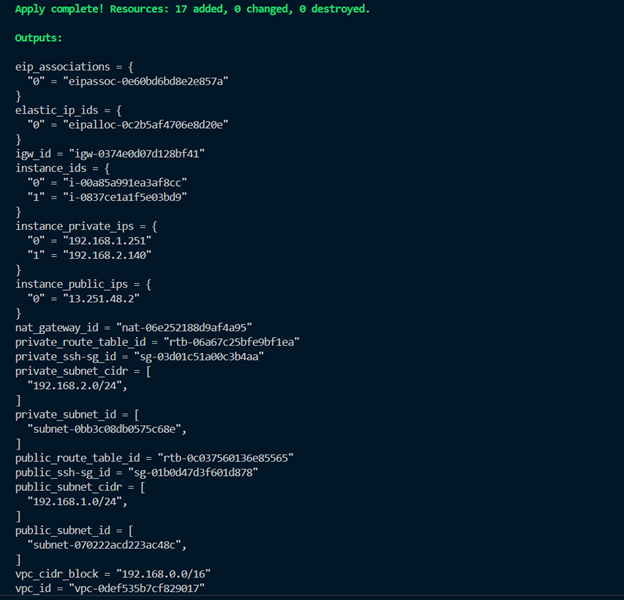

# aws-iac-terraform# Terraform Guide

## Prerequisites
1. **Configure AWS credentials**
- You must have the Access key and the Secret Access key of IAM user that has appropriate permissions to deploy AWS infrastructure
- Configure the AWS credentials on your machine using AWS CLI. If you haven't installed AWS CLI before, [check this link](https://docs.aws.amazon.com/cli/latest/userguide/getting-started-install.html)

2. **Create a SSH key pair**
- Create a key pairs at EC2 console, remember the name of the key pairs you've just created
- Download the private key (.pem file)

3. **Store the private key at AWS Secrets Manager**
- Create a secret that contains the private key of the key pair
- You can create the secret on AWS console, or using AWS CLI, as long as you choose the Plaintext option

> The provided **user-data.sh** file is preconfigured for the public instance to SSH to the private instance. If you want the **user-data.sh** file to do more actions, then write additional commands after the available scripts

> You can add your custom user-data file at the **/Terraform folder** (.sh subfix)

## Steps to Run the Source

1. **Clone the Repository**
```sh
git clone https://github.com/tramcandoit/NT548-Lab.git
cd Terraform
```

2. **Configure IAM role, IAM policy and instance profile for EC2 instance**
- Direct to the aws_iam module folder:
```sh
cd modules
cd aws_iam
```
- Modify the **default** section at **variables.tf** file *(read description at variables.tf file for details)* as your demand
- Create resource:

```sh
terraform init
terraform apply
```

3. **Modify the variables of nested module**
- Direct to the root module folder (Terraform folder):
```sh
cd ..
cd ..
```
- Modify the **default** section at **variables.tf** file *(read description at variables.tf file for details)* as your demand

- You must also change to the name of you key pairs and secret too

- **DO NOT** modify the **vpc_security_group_ids** and **subnet_id** value (null)

4. **Apply all nested modules**
- Create all resources:
```sh
terraform init
terraform apply
```
## Steps to SSH to Instances
- After apply all nested module, you will see an output similar to the one below:

- Take a look at the **instance_private_ips** and **instance_public_ips** section, these are the IPs of the instances you have just created. In my example, these IPs are:
    + **instance_private_ips**: 192.168.1.251 (private IP of public instance), 192.168.2.140 (private IP of private instance)
    + **instance_public_ips**: 13.251.48.2 (public IP of public instance)

1. **SSH to public instance**
- Locate your private key file (.pem)
- Run this command, if necessary, to ensure your key is not publicly viewable
```sh
chmod 400 <private-key-file>
```
- Connect to your instance using its public IP
```sh
ssh -i <private-key-file> <username>@<public-ip>
```
2. **SSH to private instance**
- You need to SSH to the public instance first, follow the above instruction
- On public instance:
```sh
cd ~/.ssh
```
- SSH to private instance:
```sh
ssh -i <private-key-file> <username>@<private-ip>
```